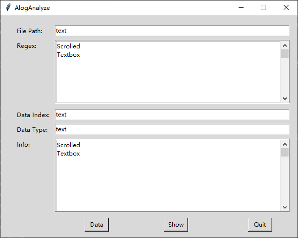

# Tkinter layout PAGE

使用PAGE进行GUI布局

# 参考文档

* [GUI drag & drop style GUI Builder for Python Tkinter](https://softwarerecs.stackexchange.com/questions/32612/gui-drag-drop-style-gui-builder-for-python-tkinter)
* [PAGE - Python Automatic GUI Generator - Version 7.6](https://page.sourceforge.net/)

# 参考代码

* [0010_AlogAnalyze](refers/0010_AlogAnalyze)

# steps

* 创建新项目: `page -p .\AlogAnalyze.tcl`
  * 开始布局
* 生成代码: 
  * 导航栏 -> [Gen-Python]
    * [Generate Support Module]
      * 先生成这个，因为后面的试运行需要用到这个代码
    * [Generate Python GUI]
      * 生成真正的布局GUI代码
* `python3 .\AlogAnalyze_support.py`  
  
